# Blink Protocol - Monorepo

[](https://opensource.org/licenses/MIT)
[](https://www.typescriptlang.org/)
[](https://nextjs.org/)

A comprehensive **privacy-preserving identity verification platform** that enables users to complete KYC once and reuse verified attestations across multiple platforms. This monorepo contains both the marketing website and the main KYC application.

> **🎯 Vision**: "Verify Once, Use Everywhere" - Complete privacy and user control over identity verification.

## 📁 Project Structure

```
├── web/                          # Landing Page Website (Port 3000)
│   ├── src/
│   │   ├── app/                  # Next.js App Router
│   │   ├── components/           # Marketing components
│   │   └── ...                   # Website assets
│   └── package.json              # Web dependencies
│
├── app/                          # Main KYC Application (Port 3001)
│   ├── src/
│   │   ├── app/                  # Next.js App Router
│   │   ├── components/           # App components
│   │   ├── lib/                  # Utilities & integrations
│   │   └── ...                   # App assets
│   └── package.json              # App dependencies
│
├── package.json                  # Root workspace config
├── README.md                     # This file
└── .gitignore                    # Git ignore rules
```

## 🚀 Quick Start

### Prerequisites
- **Node.js** 18+ and npm/yarn/pnpm
- **Git** for version control

### 1. Clone Repository

```bash
git clone https://github.com/Elishaokon13/blink-protocol-web.git
cd blink-protocol-web
```

### 2. Install Dependencies

```bash
# Install root dependencies
npm install

# Install all workspace dependencies
npm run install:all
```

### 3. Environment Setup

**For the Landing Page (web/):**
```bash
cd web
cp env.template .env.local
# Edit .env.local with your values (optional for landing page)
```

**For the Main App (app/):**
```bash
cd app
cp env.example .env.local
# Edit .env.local with required API keys
```

### 4. Development

**Run both applications:**
```bash
npm run dev
```

**Run individually:**
```bash
# Landing page only (http://localhost:3000)
npm run dev:web

# Main app only (http://localhost:3001)
npm run dev:app
```

### 5. Build for Production

```bash
# Build both applications
npm run build

# Build individually
npm run build:web
npm run build:app
```

## 🌐 Applications

### 🎨 Landing Page Website (`/web/`)
**URL**: [http://localhost:3000](http://localhost:3000)

The marketing website showcasing Blink Protocol's vision and features:

- **Hero Section**: Main value proposition with animations
- **Features Showcase**: Interactive feature demonstrations
- **How It Works**: Step-by-step process explanation
- **Developer Preview**: SDK examples and code samples
- **Comparison Table**: Traditional vs Universal KYC
- **Security Information**: Privacy and security guarantees
- **Call-to-Action**: Demo access and signup

**Key Features:**
- Responsive design with mobile-first approach
- Interactive animations using Framer Motion
- Magic UI components for enhanced UX
- SEO optimized with proper meta tags
- Dark theme with elegant styling

### 🔐 Main KYC Application (`/app/`)
**URL**: [http://localhost:3001](http://localhost:3001)

The core KYC platform with full functionality:

- **Authentication**: Privy integration for Web3 auth
- **Dashboard**: User attestation management
- **KYC Flows**: Multi-provider verification
- **Attestations**: EAS integration for tamper-proof claims
- **Access Control**: Lit Protocol for granular permissions
- **Storage**: Decentralized storage via Filecoin/Arweave

**Key Features:**
- Privacy-first architecture with zero PII storage
- Client-side encryption using AES-256-GCM
- Multi-provider KYC support (Smile Identity, Onfido, Trulioo)
- Blockchain attestations via Ethereum Attestation Service
- User-controlled access management
- Cross-platform attestation sharing

## 🛠️ Technology Stack

### Shared Technologies
- **Framework**: Next.js 14 with App Router
- **Language**: TypeScript 5.0+
- **Styling**: Tailwind CSS
- **UI Components**: Radix UI primitives
- **Icons**: Lucide React
- **Animations**: Framer Motion

### Web-Specific
- **Magic UI**: Custom animated components
- **Responsive Carousel**: Interactive showcases
- **SEO**: Optimized meta tags and structured data

### App-Specific
- **Authentication**: Privy SDK for account abstraction
- **Web3**: Wagmi + Viem for blockchain interactions
- **State Management**: React Query for server state
- **Forms**: React Hook Form with Zod validation
- **Toasts**: Sonner for notifications
- **Theme**: Next Themes for dark/light mode

### Integrations
- **KYC Providers**: Smile Identity, Onfido, Trulioo
- **Blockchain**: Ethereum Attestation Service (EAS)
- **Access Control**: Lit Protocol
- **Storage**: Filecoin, Arweave
- **Encryption**: Crypto-js for client-side encryption

## 📖 Development Workflow

### Available Scripts

```bash
# Development
npm run dev              # Run both apps
npm run dev:web          # Run landing page only
npm run dev:app          # Run main app only

# Building
npm run build            # Build both apps
npm run build:web        # Build landing page only
npm run build:app        # Build main app only

# Linting
npm run lint             # Lint both apps
npm run lint:web         # Lint landing page only
npm run lint:app         # Lint main app only

# Maintenance
npm run install:all      # Install all dependencies
npm run clean            # Clean all node_modules and build files
```

### Adding New Features

**For Landing Page:**
```bash
cd web/src/components/marketing/
# Create new component
# Import in web/src/app/(marketing)/page.tsx
```

**For Main App:**
```bash
cd app/src/components/
# Create new component in appropriate folder
# Add routing in app/src/app/
```

## 🔧 Configuration

### Environment Variables

**Web Application:**
- `NEXT_PUBLIC_APP_NAME`: Branding
- `NEXT_PUBLIC_APP_DOMAIN`: Domain configuration

**Main Application:**
- `NEXT_PUBLIC_PRIVY_APP_ID`: Privy authentication
- `NEXT_PUBLIC_LIT_NETWORK`: Lit Protocol network
- `NEXT_PUBLIC_EAS_CONTRACT_ADDRESS`: EAS contract
- `SMILE_IDENTITY_API_KEY`: KYC provider credentials
- `ONFIDO_API_KEY`: KYC provider credentials
- `TRULIOO_API_KEY`: KYC provider credentials

### Workspace Configuration

The monorepo uses npm workspaces for dependency management:

```json
{
  "workspaces": ["web", "app"]
}
```

## 🚀 Deployment

### Vercel (Recommended)

**Deploy Landing Page:**
```bash
cd web
vercel --prod
```

**Deploy Main App:**
```bash
cd app
vercel --prod
```

### Docker

```bash
# Build landing page
docker build -f web/Dockerfile -t blink-web .

# Build main app
docker build -f app/Dockerfile -t blink-app .
```

### Environment Setup for Production

Ensure all required environment variables are set:

1. **Privy App ID** for authentication
2. **API Keys** for KYC providers
3. **Ethereum RPC** endpoints
4. **EAS Contract** addresses
5. **Lit Protocol** configuration

## 📊 Architecture Overview

```mermaid
graph TB
    User[👤 User] --> Web[🌐 Landing Page]
    User --> App[🔐 KYC Application]
    
    App --> Auth[🔐 Privy Auth]
    App --> KYC[📋 KYC Providers]
    App --> Storage[🌐 Decentralized Storage]
    App --> Attestations[📝 EAS Attestations]
    App --> Access[🛡️ Lit Protocol]
    
    KYC --> Smile[Smile Identity]
    KYC --> Onfido[Onfido]
    KYC --> Trulioo[Trulioo]
    
    Storage --> Filecoin[Filecoin]
    Storage --> Arweave[Arweave]
```



## 🔐 Security Features

- ✅ **Zero PII Storage**: No personal data stored on servers
- ✅ **Client-Side Encryption**: AES-256-GCM before transmission
- ✅ **User-Controlled Access**: Cryptographic signature requirements
- ✅ **Tamper-Proof Attestations**: Blockchain-based verification
- ✅ **Decentralized Storage**: No single point of failure
- ✅ **Multi-Factor Auth**: Biometric and device-bound credentials

## 🤝 Contributing

1. Fork the repository
2. Create feature branch (`git checkout -b feature/amazing-feature`)
3. Commit changes (`git commit -m 'Add amazing feature'`)
4. Push to branch (`git push origin feature/amazing-feature`)
5. Open Pull Request

### Development Guidelines
- Follow TypeScript best practices
- Write comprehensive tests
- Maintain privacy-first approach
- Document all public APIs
- Use conventional commits

## 📚 Documentation

- **[Landing Page Guide](./web/README.md)**: Website customization
- **[Application Guide](./app/README.md)**: KYC app development
- **[API Documentation](./docs/api.md)**: REST API reference
- **[SDK Documentation](./docs/sdk.md)**: TypeScript SDK
- **[Security Guide](./docs/security.md)**: Security best practices

## 📄 License

This project is licensed under the MIT License - see the [LICENSE](./LICENSE) file for details.

## 🙏 Acknowledgments

- **Privy** for account abstraction innovation
- **Ethereum Attestation Service** for tamper-proof attestations
- **Lit Protocol** for decentralized access control
- **Next.js Team** for the amazing React framework
- **Tailwind CSS** for utility-first styling

---

**🔐 Built for Privacy. 🌍 Designed for Everyone. 🚀 Ready for the Future.**

*Blink Protocol - Where identity verification is done once, controlled by users, and private by default.* 